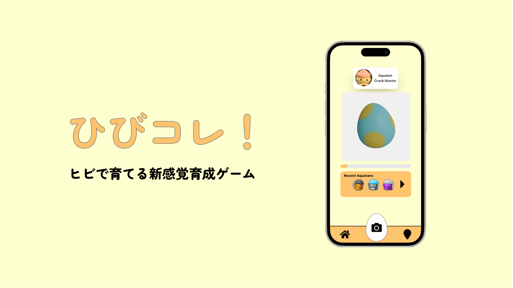

# 🥚ひびコレ！

<!--  -->

## 製品概要
### 背景 (製品開発のきっかけ、課題等）
日本の交通インフラ，とりわけ道路網は田舎から都市部まであらゆるところをカバーしていますが，それゆえ行政による道路状態の監視が追いついておらず，ヒビなどが放置されている現状があります．このプロダクトには，普段道路を使用する人々にも道路状態の監視に加わってもらい，補修箇所の発見を効率的にすることで交通インフラの整備を補助する狙いがあります．

### 製品説明（具体的な製品の説明）
アプリ「ひびコレ！」は，道路のヒビを集めて「あくあたん」の卵を孵化させる新感覚育成ゲームです．プレイヤーは道路のヒビを撮影することで「あくあたん」の卵の孵化を促進させ，孵化した「あくあたん」をコレクションに加えることができます．撮影したヒビの情報は道路管理者に送られます．

このアプリは，道路のインフラ整備の遅れという社会課題に対して「色んな人が」「楽しく」取り組めるようにデザインされています．想定ユーザは「普段道路を利用する人々」と「道路管理者」の両者であり，道路のヒビを撮影することでプレイヤー（道路利用者）はゲームを進めることができ，道路管理者はプレイヤーの情報からヒビの大きさや場所を入手し，道路補修の計画の判断材料とすることができます．

### 特長
#### ・ スマートフォンでインフラ整備！
ヒビをスマートフォンで撮影することで，道路の管理者へ報告が行き，スムーズなインフラ整備を手助けすることができます．

#### ・ 育成ゲームで継続率UP！
「あくあたん」の卵はヒビを集めることで孵化します．たくさんヒビを見つけて卵を孵化させましょう！

🎥 [デモ動画を見る](https://github.com/user-attachments/assets/1141d045-291d-4522-bc69-def7ee784bbd)
#### ・ 色んなあくあたんをコレクション！
生まれてくるあくあたんの種類はさまざま！集めたヒビの種類や大きさによっても変わるかも？

#### ・ 大きいヒビは高得点！
見つけたヒビは，その大きさなどによって危険度が予測され，大きいほど卵の孵化が早くなります．大きいヒビは積極的に撮影しましょう！

#### ・ Map機能によりヒビの多い箇所が一目瞭然！
ユーザが集めたヒビの位置，種類，危険度は誰でもマップ上から見ることができます．
管理者が道路の現状を把握するだけでなく，ユーザ達も危険な場所を簡単に知ることができます！

### 解決出来ること
元来，道路の補修箇所の発見は道路維持作業員の目視で行っていましたが，その管理対象は数百kmに及ぶこともあり，巡回や目視での発見には限界があります．通行不能なほど大きなヒビは通報によってすぐ判明することもありますが，「大きいヒビだけどまぁ通行はできるか...」程度のものは作業員に発見されず放置されることもしばしば．

アプリ「ひびコレ！」はこの問題を解決します．ゲームを通じて普段道路を利用する人々にも「道路維持作業員」になってもらい，楽しみながら道路補修箇所の発見作業を支援を行えます．集めたヒビはマップ上で確認でき，データは道路管理者へ送られるので，道路補修におけるコスト・労力を大きく下げることができます．

### 今後の展望
* 現在数体の「あくあたん」が実装されていますが，今後は更にその種類を増やそうと考えています．

* 現時点では「あくあたん」が卵から孵ってしまえばその個体の育成は終わりですが，今後は卵から孵った後の育成要素も考えています．

* 道路のヒビの情報を実際に管理者に送るシステムの構築も急務です．

### 注力したこと（こだわり等）
* 実際に撮影したヒビは，ゲーム内の卵のヒビとして反映されます．

* 「あくあたん」は卵から孵ろうと頑張っています．ヒビの入り具合によって卵の動きが変わります．

* ロード画面にもこだわっています．是非ご注目を！

#### 3Dモデルのタマゴにヒビを反映

| 初期状態のタマゴ🥚 | 投稿されたヒビを反映したタマゴ |
| --- | --- |
|  |  |

#### ヒビ画像のセグメント抽出と分類

1. DeepCrack (既存研究) のモデルを用いて，セグメントを抽出
2. ResNetをファインチューニングし，ヒビの種類と危険度を算出

| 元画像 | セグメント画像 |
| --- | --- |
|  |  | 

## 開発技術
### 活用した技術
#### API・データ
##### フロントエンド
* NextJs
* Shadcn
* Tailwind
* Three.js

##### バックエンド
* FastAPI
* DeepCrack
* PyTorch

##### データベース
* Supabase

##### その他
* Blender
* Figma

#### デバイス
* Google Chrome
* 

### 独自技術
#### ハッカソンで開発した独自機能・技術
* ヒビ分類のための深層学習モデル
  * ResNetをベースにファインチューニングを行うことで，画像からヒビの種類と危険度を分類できるようにしました．ヒビのデータに種類と危険度のラベリングを行い，ResNetを、最後の全結合層を除去して特徴ベクトルを抽出し、その上に2つの出力を作成することで，高速，高精度でヒビの種類と危険度を予測できるようにしました．

* セグメント → 3Dビジュアライズ
  * Blenderで作成したタマゴのモデルに，撮影されたヒビをセグメント，反映できるようにしました．

* オリジナルGIF
  * テーマにあった可愛いオリジナルのGIFを作成しました．

|  | |  |
| --- | --- | --- |
|  |  | |
